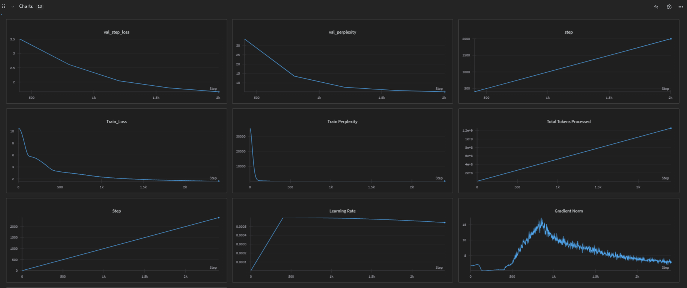

# StoryKimi - DeepSeek V3 Inspired Model

A PyTorch implementation of a DeepSeek V3 inspired transformer model with Mixture of Experts (MoE), Latent Attention, and other advanced features.



## 📊 Training Results & Model Weights

**📈 View Training Report**: [StoryKimi Training Results on WandB](https://wandb.ai/rentio/DSV-Training/reports/SmolKimi-A-smaller-Kimi-K2---VmlldzoxMzYwNDQ4Mg?accessToken=lfs6n1y7gn8q0f0dwilta8yuwzxel45ztzbbcavwbqp7jsyv1p7cz9elflycv9fg)

**💾 Download Pre-trained Weights**: 
- **Hugging Face Model**: [YuvrajSingh9886/StoryKimi](https://huggingface.co/YuvrajSingh9886/StoryKimi)
- **WandB Checkpoints**: Check the WandB report above for additional trained model checkpoints

## Features

- **Latent Attention**: Efficient attention mechanism with compressed key-value representations
- **Mixture of Experts (MoE)**: 8 experts with top-2 routing and shared expert support
- **SWiGLU Activation**: Advanced activation function in expert layers
- **Sinusoidal Positional Embeddings**: Position encoding for sequence understanding
- **Liger Kernels**: Optimized kernels for faster training (optional)
- **Distributed Training**: Support for multi-GPU training with DDP
- **Advanced Optimizer**: Muon optimizer with auxiliary Adam for better convergence
- **Gradio Interface**: Interactive web interface for text generation

## Model Architecture

### Default Configuration
- **Embedding Dimensions**: 384
- **Decoder Layers**: 6
- **Attention Heads**: 8
- **MoE Experts**: 8 (top-2 routing)
- **Block Size**: 128 tokens
- **Vocabulary Size**: Based on Llama-2-7b tokenizer (~32,000 tokens)
- **Latent Dimension**: 64 (for compressed attention)

### Full Parameter List

#### Model Architecture Parameters
- `--block_size`: Maximum sequence length (default: 128)
- `--batch_size`: Training batch size (default: 256)
- `--embeddings_dims`: Model embedding dimensions (default: 384)
- `--no_of_heads`: Number of attention heads (default: 8)
- `--no_of_decoder_layers`: Number of decoder layers (default: 6)
- `--latent_dim`: Latent dimension for attention (default: 64)

#### Mixture of Experts (MoE) Parameters
- `--experts`: Number of MoE experts (default: 8)
- `--top_experts`: Number of experts to route to (default: 2)
- `--use_shared_expert`: Enable shared expert in MoE (default: True)
- `--noisy_topk`: Use noisy top-k routing (default: False)
- `--useauxFreeLoadBalancingLoss`: Use auxiliary-free load balancing loss (default: True)
- `--aux_free_bias_update_rate`: Bias update rate for load balancing (default: 0.001)
- `--loss_scale`: Loss scaling factor (default: 0.3)

#### Training Hyperparameters
- `--epochs`: Number of training epochs (default: 1)
- `--max_lr`: Maximum learning rate (default: 6e-4)
- `--weight_decay_optim`: Weight decay for optimizer (default: 0.1)
- `--beta_1`: Beta1 for optimizer (default: 0.9)
- `--beta_2`: Beta2 for optimizer (default: 0.95)
- `--eps`: Epsilon for optimizer (default: 1e-8)
- `--clip`: Gradient clipping value (default: 1.0)

#### Regularization Parameters
- `--dropout`: Dropout rate (default: 0.1)
- `--attn_dropout`: Attention dropout rate (default: 0.1)

#### System Configuration
- `--device`: Device to use (default: 'cuda')
- `--use_checkpointing`: Use gradient checkpointing (default: False)
- `--use_liger`: Use Liger kernels for optimization (default: True)
- `--ignore_pad_token_in_loss`: Ignore padding tokens in loss calculation (default: True)

#### Data Configuration
- `--vocab_size`: Vocabulary size (default: 32000, updated based on tokenizer)
- `--base_freq`: Base frequency for positional encoding (default: 100000)
- `--hf_token`: Hugging Face token for accessing gated models like Llama-2 (default: None)
- `--dataset`: Dataset to use ('tinystories', 'fineweb', 'tinyshakespeare') (default: 'tinystories')

#### Generation Parameters
- `--generation_max_length`: Maximum length for text generation (default: 50)
- `--generation_top_k`: Top-k value for sampling (default: 50)
- `--generation_temperature`: Temperature for sampling (default: 1.0)

#### Logging and Checkpointing
- `--log_interval`: Steps between logging (default: 100)
- `--save_interval`: Steps between saving checkpoints (default: 2000)
- `--eval_interval`: Steps between evaluation (default: 400)
- `--eval_iters`: Number of iterations for evaluation (default: 400)
- `--warmup_iters`: Number of warmup iterations (default: 400)
- `--total_iters`: Total training iterations (default: 10000)
- `--lr_decay_iters`: Learning rate decay iterations (default: 10000)
- `--wandb_project`: Wandb project name (default: 'storykimi')
- `--wandb_run_name`: Wandb run name (default: None)

#### Batch Size Configuration
- `--total_batch_size`: Total batch size for gradient accumulation (default: 524288)
- `--micro_batch_size`: Micro batch size (default: batch_size)

#### Distributed Training
- `--use_ddp`: Use distributed data parallel (default: False)

## Quick Start

### Installation

```bash
chmod +x install.sh
./install.sh
```

### Using Pre-trained Weights

1. **Download Model Weights**: 
   - **Option 1**: Download from [Hugging Face - YuvrajSingh9886/StoryKimi](https://huggingface.co/YuvrajSingh9886/StoryKimi)
   - **Option 2**: Visit the [WandB Training Report](https://wandb.ai/rentio/DSV-Training/reports/SmolKimi-A-smaller-Kimi-K2---VmlldzoxMzYwNDQ4Mg?accessToken=lfs6n1y7gn8q0f0dwilta8yuwzxel45ztzbbcavwbqp7jsyv1p7cz9elflycv9fg) for additional checkpoints
   - Place downloaded files in the `checkpoints/` directory

2. **Load Pre-trained Model for Inference**:
   ```bash
   # Using the Gradio web interface
   python gradio/app.py --hf_token "your_token_here"
   
   # Or use in your own code
   python inference.py --checkpoint_path checkpoints/your_checkpoint.pt
   
   # Using Hugging Face transformers (if available)
   from transformers import AutoModel, AutoTokenizer
   model = AutoModel.from_pretrained("YuvrajSingh9886/StoryKimi")
   ```

### Important: Hugging Face Token Setup

Since this model uses the Llama-2 tokenizer, you'll need a Hugging Face token to access the gated model. 

1. **Get a Hugging Face Token:**
   - Go to [Hugging Face Settings](https://huggingface.co/settings/tokens)
   - Create a new token with "Read" permissions
   - Accept the Llama-2 license at [meta-llama/Llama-2-7b-hf](https://huggingface.co/meta-llama/Llama-2-7b-hf)

2. **Set your token in one of these ways:**
   ```bash
   # Option 1: Environment variable (recommended)
   export HF_TOKEN="your_token_here"
   
   # Option 2: Pass as command line argument
   python trainer.py --hf_token "your_token_here"
   ```

### Training Examples

#### Basic Training (Single GPU)
```bash
# With environment variable
export HF_TOKEN="your_token_here"
python trainer.py

# With command line argument
python trainer.py --hf_token "your_token_here"
```

#### Training with Custom Parameters
```bash
# Train with larger model
python trainer.py --hf_token "your_token_here" --embeddings_dims 512 --no_of_heads 16 --no_of_decoder_layers 8

# Train with different dataset
python trainer.py --hf_token "your_token_here" --dataset fineweb --epochs 3

# Train with custom learning rate and batch size
python trainer.py --hf_token "your_token_here" --max_lr 1e-3 --batch_size 128 --block_size 256

# Train with more experts
python trainer.py --hf_token "your_token_here" --experts 16 --top_experts 4

# Train without shared expert
python trainer.py --hf_token "your_token_here" --use_shared_expert False

# Train with noisy top-k routing
python trainer.py --hf_token "your_token_here" --noisy_topk True
```

#### Multi-GPU Distributed Training
```bash
# Set token as environment variable for distributed training
export HF_TOKEN="your_token_here"

# 2 GPUs
torchrun --nproc_per_node=2 trainer.py

# 4 GPUs with custom parameters
torchrun --nproc_per_node=4 trainer.py --batch_size 128 --embeddings_dims 512

# 8 GPUs with large model configuration
torchrun --nproc_per_node=8 trainer.py \
    --embeddings_dims 768 \
    --no_of_heads 12 \
    --no_of_decoder_layers 12 \
    --experts 16 \
    --top_experts 4 \
    --batch_size 64 \
    --block_size 512
```

#### Advanced Training Configurations

##### High-Performance Setup
```bash
export HF_TOKEN="your_token_here"
python trainer.py \
    --embeddings_dims 768 \
    --no_of_heads 12 \
    --no_of_decoder_layers 12 \
    --experts 16 \
    --top_experts 4 \
    --batch_size 32 \
    --block_size 512 \
    --max_lr 3e-4 \
    --epochs 5 \
    --use_liger True \
    --wandb_project "storykimi-large"
```

##### Experimental Setup
```bash
export HF_TOKEN="your_token_here"
python trainer.py \
    --noisy_topk True \
    --use_shared_expert False \
    --aux_free_bias_update_rate 0.01 \
    --loss_scale 0.5 \
    --dropout 0.2 \
    --attn_dropout 0.15 \
    --wandb_project "storykimi-experimental"
```

##### Memory-Efficient Setup
```bash
export HF_TOKEN="your_token_here"
python trainer.py \
    --use_checkpointing True \
    --batch_size 64 \
    --micro_batch_size 16 \
    --total_batch_size 262144 \
    --block_size 128
```

### Inference with Gradio

```bash
# Set your HF token
export HF_TOKEN="your_token_here"

# Run the Gradio app
cd gradio
python app.py --hf_token "your_token_here"

# Or with environment variable
cd gradio
python app.py

# With custom port and public sharing
cd gradio
python app.py --hf_token "your_token_here" --port 8080 --share
```

### Help and Parameter Information

```bash
# View all available parameters
python trainer.py --help

# View Gradio app parameters
cd gradio
python app.py --help
```

### Environment Variables

You can set the following environment variables instead of passing them as arguments:

```bash
# Hugging Face token (recommended approach)
export HF_TOKEN="your_token_here"

# Wandb API key (optional, for experiment tracking)
export WANDB_API_KEY="your_wandb_key_here"
```

## File Structure

```
StoryKimi/
├── config.py          # Model configuration and hyperparameters with argparse
├── model.py           # Model architecture (DeepSeekV3, MoE, Attention, etc.)
├── tokenizer.py       # Tokenizer setup
├── data.py           # Data loading and preparation
├── inference.py      # Inference functions and text generation
├── trainer.py        # Main training loop with DDP support
├── install.sh        # Setup script
├── requirements.txt  # Python dependencies
├── gradio/
│   ├── app.py        # Gradio web interface
│   └── requirements.txt
└── generated_data/   # Generated text outputs
```

## Training Features

- **Gradient Accumulation**: Configurable batch size scaling
- **Learning Rate Scheduling**: Cosine decay with warmup
- **Gradient Clipping**: Prevents gradient explosion
- **Wandb Integration**: Experiment tracking and logging
- **Checkpointing**: Regular model checkpoints during training
- **Loss Calculation**: Optimized cross-entropy with padding token handling
- **Distributed Training**: Multi-GPU support with DDP
- **Memory Optimization**: Gradient checkpointing support

## Generation Methods

1. **Top-k Sampling**: Traditional sampling with temperature control
2. **Beam Search**: Deterministic search for high-quality outputs

## Advanced Usage

### Configuration Files
All parameters can be set via command line arguments. For complex configurations, consider creating shell scripts:

```bash
#!/bin/bash
# large_model_config.sh
python trainer.py \
    --embeddings_dims 1024 \
    --no_of_heads 16 \
    --no_of_decoder_layers 24 \
    --experts 32 \
    --top_experts 8 \
    --batch_size 16 \
    --block_size 1024 \
    --max_lr 1e-4 \
    --epochs 10 \
    --use_liger True \
    --use_checkpointing True \
    --wandb_project "storykimi-large-scale"
```

### Custom Dataset Training
```bash
# TinyStories (default)
python trainer.py --dataset tinystories

# FineWeb (large scale)
python trainer.py --dataset fineweb --epochs 3 --batch_size 64

# TinyShakespeare (character level)
python trainer.py --dataset tinyshakespeare --block_size 256
```

### Monitoring and Logging
```bash
# Custom wandb configuration
python trainer.py \
    --wandb_project "my-experiment" \
    --wandb_run_name "test-run-1" \
    --log_interval 50 \
    --eval_interval 200 \
    --save_interval 1000
```

### Hardware-Specific Optimizations

#### For High-Memory GPUs (A100, H100)
```bash
python trainer.py \
    --batch_size 512 \
    --block_size 2048 \
    --embeddings_dims 1024 \
    --total_batch_size 1048576
```

#### For Low-Memory GPUs (RTX 3080, 4080)
```bash
python trainer.py \
    --batch_size 32 \
    --micro_batch_size 8 \
    --block_size 128 \
    --use_checkpointing True \
    --embeddings_dims 256
```

### Usage Examples

#### Basic Training
```python
from trainer import train
train()
```

#### Text Generation
```python
from inference import topk_sampling
from model import DeepSeekV3
from config import ModelArgs, get_args

# Load with custom config
args = get_args()
model_args = ModelArgs(args)
model = DeepSeekV3(device='cuda')
text = topk_sampling(model, "Once upon a time", device='cuda')
```

#### Loading a Trained Model
```python
import torch
from model import DeepSeekV3
from config import ModelArgs, get_args

# Load saved model
args = get_args()
model_args = ModelArgs(args)
model = DeepSeekV3(device='cuda')
model.load_state_dict(torch.load('path/to/checkpoint.pt'))
model.eval()
```

## Performance Tips

1. **Use Mixed Precision**: Enable automatic mixed precision for faster training
2. **Gradient Checkpointing**: Use `--use_checkpointing True` for memory-constrained setups
3. **Liger Kernels**: Keep `--use_liger True` for optimized operations
4. **Batch Size Tuning**: Start with smaller batch sizes and increase gradually
5. **Block Size**: Larger block sizes improve quality but require more memory

## Troubleshooting

### Common Issues

#### Authentication Error (401)
```bash
# Make sure you have accepted the Llama-2 license and have a valid token
# Visit: https://huggingface.co/meta-llama/Llama-2-7b-hf
# Then set your token:
export HF_TOKEN="your_token_here"
```

#### Out of Memory (OOM)
```bash
# Reduce batch size and enable checkpointing
python trainer.py --hf_token "your_token_here" --batch_size 16 --use_checkpointing True

# Use gradient accumulation
python trainer.py --hf_token "your_token_here" --batch_size 32 --micro_batch_size 8
```

#### Slow Training
```bash
# Enable Liger kernels and increase batch size
python trainer.py --hf_token "your_token_here" --use_liger True --batch_size 256

# Use multiple GPUs
export HF_TOKEN="your_token_here"
torchrun --nproc_per_node=4 trainer.py
```

#### NaN Loss
```bash
# Reduce learning rate and enable gradient clipping
python trainer.py --hf_token "your_token_here" --max_lr 1e-4 --clip 0.5
```

## Contributing

Feel free to contribute improvements, bug fixes, or new features!

## Requirements

- Python 3.8+
- PyTorch 2.0+
- Transformers
- Datasets
- Gradio
- Wandb
- Liger-kernel (optional)
- Muon optimizer

## License

MIT License
